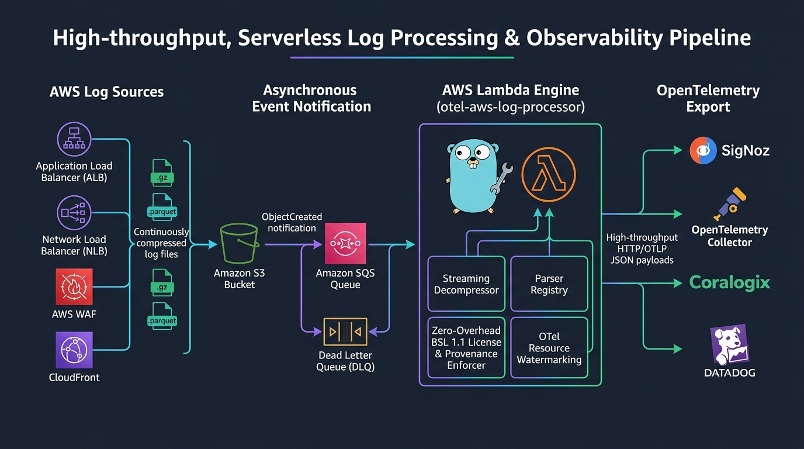

# AWS Log to OTel Processor

[](https://github.com/divmora/otel-aws-log-processor/releases)
[](https://github.com/divmora/.github/blob/main/LICENSING.md)
[](https://github.com/divmora/otel-aws-log-processor/actions)
[](go.mod)
[](https://divmora.github.io/otel-aws-log-processor/)
[](https://deepwiki.com/divmora/otel-aws-log-processor)
[](SECURITY.md)

A high-performance Go-based AWS Lambda application that parses and converts AWS access logs into OpenTelemetry (OTLP) log records, exporting them via HTTP to any OTLP-compatible backend (e.g., SigNoz, OpenTelemetry Collector, Coralogix, Datadog).

[Documentation](https://divmora.github.io/otel-aws-log-processor/) • [Roadmap](ROADMAP.md) • [Ask DeepWiki](https://deepwiki.com/divmora/otel-aws-log-processor)

---

## Overview

This Lambda function is triggered via **Amazon SQS**, which receives S3 ObjectCreated events (either directly or via Amazon EventBridge) when log files are written to S3. It streams, uncompresses, parses, and transforms access logs into semantic OpenTelemetry `LogRecord` batches grouped by target resource ARN/ID.

### Supported AWS Log Types

- **Application Load Balancer (ALB)**: Standard access logs (`.log`, `.log.gz`).
- **Network Load Balancer (NLB)**: TLS and TCP connection logs (`.log`, `.log.gz`).
- **AWS WAF**: Web Application Firewall JSON logs (`.json`, `.gz`).
- **CloudFront**: Standard access logs (`.gz`) and columnar Parquet logs (`.parquet`).

---

## Architecture & Project Layout

<p align="center">
  
</p>

```
otel-aws-log-processor/
├── cmd/
│   └── lambda/                # AWS Lambda entrypoint (SQS event consumer)
├── pkg/
│   ├── events/                # S3 and EventBridge SQS event parsing
│   ├── model/                 # OpenTelemetry JSON data models
│   ├── parser/                # Dedicated log parsers (ALB, NLB, WAF, CloudFront)
│   ├── processor/             # File-matching registry and LogAdapter conversions
│   ├── sender/                # OTLP HTTP batching and retry client
│   └── utils/                 # Helpers (AWS trace IDs, URLs, env vars, time)
├── .github/
│   ├── dependabot.yml         # Automated dependency updates
│   └── workflows/             # Reusable CI/CD, release, and PR workflows
├── .goreleaser.yaml           # Multi-architecture binary and Lambda zip packaging
├── Dockerfile                 # Multi-stage container build for provided.al2023
└── Makefile                   # Standardized build and test targets
```

---

## Features & Design

- ⚡ **High Throughput & Memory Efficient**: Streams S3 log objects line-by-line without buffering large compressed files into memory.
- 🔄 **Semantic Resource Batching**: Automatically groups log records by cloud resource ID (e.g., ALB ARN, CloudFront Distribution ID) prior to HTTP dispatch to maintain semantic resource scoping in OTLP backends.
- 🛡️ **Reliable Delivery & Concurrency**: Leverages SQS concurrency controls with configurable HTTP retry backoff and batch size limits.
- 📦 **Multi-Architecture Builds**: Native builds for ARM64 (`provided.al2023`) and AMD64.

---

## Configuration

The Lambda handler is configured entirely via environment variables:

| Variable | Description | Default |
| :--- | :--- | :--- |
| `OTLP_HTTP_LOGS_ENDPOINT` | HTTP destination endpoint for OTLP logs | `http://localhost:4318/v1/logs` |
| `BASIC_AUTH_USERNAME` | Basic authentication username (optional) | `""` |
| `BASIC_AUTH_PASSWORD` | Basic authentication password (optional) | `""` |
| `MAX_BATCH_SIZE` | Max log records per OTLP HTTP batch request | `500` |
| `MAX_RETRIES` | Number of retry attempts on failed HTTP requests | `3` |
| `MAX_CONCURRENT` | Concurrency limit for file processing & HTTP sending | `10` |
| `ENVIRONMENT` | Environment name (`development`, `staging`, `production`, etc.) | `production` |
| `DIVMORA_LICENSE_KEY` | Commercial Ed25519 license token (required for production) | `""` |
| `DIVMORA_LICENSE_MODE` | Production enforcement mode (`warn` non-blocking or `strict`) | `warn` |
| `DIVMORA_LICENSE_FAILURE_ACTION` | SQS behavior on strict license failure (`discard` to stop retry loops, or `dlq`) | `discard` |

---

## AWS IAM Permissions

Deploy the Lambda function with the following least-privilege IAM policy:

```json
{
  "Version": "2012-10-17",
  "Statement": [
    {
      "Sid": "S3LogBucketAccess",
      "Effect": "Allow",
      "Action": [
        "s3:GetObject"
      ],
      "Resource": "arn:aws:s3:::<your-aws-logs-bucket>/*"
    },
    {
      "Sid": "SQSTriggerAccess",
      "Effect": "Allow",
      "Action": [
        "sqs:ReceiveMessage",
        "sqs:DeleteMessage",
        "sqs:GetQueueAttributes"
      ],
      "Resource": "arn:aws:sqs:<region>:<account-id>:<your-log-events-queue>"
    },
    {
      "Sid": "CloudWatchLogs",
      "Effect": "Allow",
      "Action": [
        "logs:CreateLogGroup",
        "logs:CreateLogStream",
        "logs:PutLogEvents"
      ],
      "Resource": "arn:aws:logs:*:*:*"
    }
  ]
}
```

---

## Deployment

### 1. Build Deployment Package

To build the Lambda deployment package for AWS Lambda (`provided.al2023`, ARM64):

```bash
make lambda-package
```

This compiles a stripped `bootstrap` binary and packages it into `lambda.zip`.

### 2. Deploy Lambda Function

```bash
aws lambda create-function \
  --function-name otel-aws-log-processor \
  --runtime provided.al2023 \
  --handler bootstrap \
  --zip-file fileb://lambda.zip \
  --role arn:aws:iam::<ACCOUNT_ID>:role/<lambda-execution-role> \
  --architectures arm64 \
  --timeout 300 \
  --memory-size 512 \
  --environment "Variables={OTLP_HTTP_LOGS_ENDPOINT=https://ingest.your-observability.com/v1/logs,MAX_BATCH_SIZE=500}"
```

### 3. Configure SQS Trigger

```bash
aws lambda create-event-source-mapping \
  --function-name otel-aws-log-processor \
  --event-source-arn arn:aws:sqs:<REGION>:<ACCOUNT_ID>:<queue-name> \
  --batch-size 10
```

### 4. Infrastructure as Code (CloudFormation)

Production-ready AWS CloudFormation templates with automated SQS Ingestion Queue, Dead Letter Queue (DLQ), IAM least-privilege execution roles, CloudWatch alarms, and AWS Secrets Manager integration are maintained in the [`divmora/cloudformation-templates`](https://github.com/divmora/cloudformation-templates/tree/main/otel-aws-log-processor) repository.

---

## Development & Building

### Prerequisites
- **Go 1.26+**: [golang.org](https://golang.org/dl/)
- **Make**: Build automation
- **Docker**: Containerization and multi-arch builds

### Common Make Targets

```bash
# Build binary locally
make build

# Run all unit tests
make test

# Run unit tests with code coverage analysis
make test-coverage

# Format source code
make fmt

# Run linter
make lint

# Package AWS Lambda zip
make lambda-package

# Build local Docker image
make docker-build

# Preview documentation locally
make docs-serve
```

---

## Community & Contributing

We welcome contributions from the community! Please review our community documents:

- **[Contributing Guide](CONTRIBUTING.md)**: Guidelines for local setup, pull requests, and conventional commits.
- **[Subscription Plans & Feature Matrix](docs/plans.md)**: Breakdown of Community (Free Non-Prod), Pro, and Enterprise tiers and feature entitlements.
- **[Code of Conduct](CODE_OF_CONDUCT.md)**: Community standards and expectations.
- **[Security Policy](SECURITY.md)**: Vulnerability disclosure guidelines and SLA.

---

## License & Commercial Use

This project is licensed under the **Business Source License 1.1 (BSL 1.1)** - see the [LICENSE](LICENSE) file for details.

- **Non-Production Use**: 100% free of charge for local development, staging, QA, testing, CI/CD automated validation, and proof-of-concept evaluation. Simply set `ENVIRONMENT=development` or `staging`.
- **Change Date Conversion**: Automatically converts to the permissive **Apache License, Version 2.0** exactly three (3) years after each release.
- **Production Deployments**: Production use requires a valid commercial license (EULA) from DIVMORA Technologies. See **[docs/plans.md](docs/plans.md)** for detailed subscription plans and the feature entitlement matrix.

### Supplying a Commercial License

For container and serverless AWS Lambda deployments, supply your cryptographic license token via the `DIVMORA_LICENSE_KEY` environment variable in your Lambda function configuration or Terraform module:

```bash
export DIVMORA_LICENSE_KEY="DIV1.<payload>.<signature>"
```

Alternatively, mount a license file and point to its location using `DIVMORA_LICENSE_FILE=/path/to/license.key`.

### Production Enforcement Modes

| Mode | Behavior |
| :--- | :--- |
| `DIVMORA_LICENSE_MODE=warn` *(Default)* | Emits structured warnings and stamps `divmora.license.status=unlicensed_production_alert` in OTel telemetry and CloudWatch EMF without dropping logs or disrupting production pipelines. |
| `DIVMORA_LICENSE_MODE=strict` | Strictly enforces licensing compliance, rejecting invocations if unverified or expired past the 14-day grace period. |

#### Serverless SQS Retry Loop Prevention

In AWS Lambda with SQS triggers, returning an unhandled error to the runtime causes SQS to treat the batch as a transient failure, repeatedly redriving messages and inflating Lambda execution costs.

To prevent infinite retry storms on deterministic license failures in `strict` mode:
- **Pre-flight Fast Fail**: Baseline license compliance is verified *before* downloading S3 log files, eliminating wasted S3 GET API calls and data transfer fees.
- **`DIVMORA_LICENSE_FAILURE_ACTION=discard` *(Default)***: Cleanly acknowledges and deletes unprocessable messages from the SQS queue, immediately halting the retry storm while emitting CloudWatch EMF violation metrics and structured error logs.
- **`DIVMORA_LICENSE_FAILURE_ACTION=dlq`**: Marks batch items in `BatchItemFailures` so SQS cleanly advances redrive counts to the Dead Letter Queue without crashing the Lambda container.

### Certificate Revocation Lists (CRL) — Offline & Online

`otel-aws-log-processor` supports both offline (air-gapped) and online dynamically synchronized Certificate Revocation Lists:

- **Offline CRL (Air-Gapped & Serverless)**:
  - **Environment Variable**: Set `DIVMORA_CRL="DIVCRL1.<payload>.<sig>"` (token or armored PEM) or `DIVMORA_CRL_FILE="/path/to/crl.divcrl"`.
  - **Lambda Sidecar File**: Package `crl.divcrl` directly at the root of `lambda.zip` (discovered via `$LAMBDA_TASK_ROOT`).
  - **Default System Path**: Mount at `/etc/divmora/crl.divcrl`.
- **Online CRL Synchronization**:
  - **Remote Endpoint URL**: Set `DIVMORA_CRL_URL="https://crl.divmora.com/otel-aws-log-processor.divcrl"`.
  - **Resilient Disk Caching**: Downloaded CRLs are verified and cached to disk (`/tmp/divmora-crl.cache` or `DIVMORA_CRL_CACHE_FILE`) with HTTP `ETag` conditional caching to protect against transient network partitions.

Revoked licenses return `license.ErrLicenseRevoked` and emit alerts in CloudWatch EMF.

### Managing & Inspecting Licenses (`license-cli`)

Install the official DIVMORA licensing toolkit CLI:

```bash
go install github.com/divmora/license-go/cmd/license-cli@v1.3.1
```

Inspect and verify license tokens and quotas:

```bash
# Inspect commercial license claims:
license-cli inspect -license /path/to/license.key

# Check license status & quota consumption:
license-cli status -license /path/to/license.key -usage "max_streams=5"
```

For enterprise licensing, custom SLAs, and commercial inquiries, please contact **[licensing@divmora.com](mailto:licensing@divmora.com)** or visit **[divmora.com](https://divmora.com)**.
