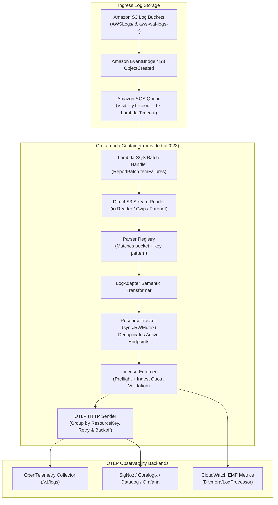

# AWS Log to OpenTelemetry Processor: Architecture & Operational Manual

`otel-aws-log-processor` is a high-performance, memory-efficient AWS Lambda application engineered in Go. It ingests access logs produced by AWS edge, networking, and security services, parses their contents via streaming readers, maps log attributes to standard OpenTelemetry (OTel) semantic conventions, and exports them in semantic batches over HTTP to any OTLP-compliant receiver.

---

## 1. High-Level Architecture & Pipeline



### 1.1 Ingestion Flow & Lifecycle
1. **Event Delivery**: As AWS services (ALB, NLB, CloudFront, WAF) write compressed logs to Amazon S3, S3 `ObjectCreated` notifications are dispatched via Amazon EventBridge to an Amazon SQS queue.
2. **Lambda Invocations**: The Lambda handler is triggered with batches of SQS messages (default batch size: 10).
3. **Pre-flight Fast Fail**: In `DIVMORA_LICENSE_MODE=strict`, pre-flight verification validates token integrity, expiration, and environment before initiating S3 network requests. Deterministic license failures are halted immediately, deleting the message (`DIVMORA_LICENSE_FAILURE_ACTION=discard`) to suppress costly SQS retry storms.
4. **Streaming Decompression**: The processor streams S3 objects line-by-line via buffered `io.Reader` scanners without buffering entire archives into memory. RAM utilization remains between 256MB and 512MB even when processing multi-hundred megabyte logs.
5. **Parser Registry**: S3 bucket names and object keys are matched against registered parsers (`Matches(bucket, key)`).
6. **LogAdapter Transformation**: Log lines are converted into typed `LogAdapter` structures that define target resource attributes, log body, severity, timestamps, and OpenTelemetry trace IDs parsed from AWS X-Ray headers.
7. **Monitored Resource Tracking**: In-container `ResourceTracker` registers unique resource ARNs/IDs across concurrent worker routines.
8. **Semantic Grouping & Dispatch**: Records are grouped by unique `ResourceKey` (e.g. TargetGroup ARN or Distribution ID) and dispatched via HTTP POST in batches of up to `MAX_BATCH_SIZE` (default: 500) to the designated OTLP receiver.
9. **CloudWatch EMF Metric Flushing**: Metric payloads adhering to AWS CloudWatch Embedded Metric Format (EMF) are asynchronously emitted, recording `RecordsProcessed`, `LicenseViolations`, and `ActiveMonitoredResources`.

---

## 2. Supported AWS Log Sources

| Log Type | Supported Extensions | Parser Implementation | Resource Identifier | Sample Key Pattern |
|---|---|---|---|---|
| **Application Load Balancer (ALB)** | `.log`, `.log.gz` | Regex streaming parser | TargetGroup ARN or ELB ARN | `AWSLogs/<acct>/elasticloadbalancing/<region>/...` |
| **Network Load Balancer (NLB)** | `.log`, `.log.gz` | Tab/space streaming parser | TargetGroup ARN or NLB ARN | `AWSLogs/<acct>/elasticloadbalancing/<region>/.../net/...` |
| **Amazon CloudFront** | `.gz` (W3C), `.parquet` | W3C Scanner / Parquet reader | Distribution ID (`[A-Z0-9]{8,32}`) | `.../<distribution-id>.<date>-<time>.<hash>.gz` |
| **AWS WAF** | `.json`, `.gz` | JSON streaming parser | WebACL ARN / Name | `aws-waf-logs-.../AWSLogs/<acct>/WAFLogs/...` |

---

## 3. Commercial Licensing: Monitored Resource Packs

### 3.1 Motivation: Decoupling from Raw AWS Accounts
In modern cloud environments adopting AWS Organizations, AWS Control Tower, or Landing Zone Accelerator, companies frequently operate dozens or hundreds of micro-accounts (spoke accounts) for workload isolation.

- **The Problem**: A company with 25 spoke accounts running 1 ALB each would face a 25x license cost penalty under traditional per-account pricing, despite having the exact same infrastructure footprint as a single monolithic account with 25 ALBs.
- **The Solution**: Commercial pricing is pegged to **Monitored Resource Packs** rather than raw AWS account counts.

### 3.2 Definition of a Monitored Resource
A Monitored Resource is any distinct active ingress endpoint from which logs are collected:
1. **ALB**: An Application Load Balancer instance (`...:loadbalancer/app/<name>/<id>`).
2. **NLB**: A Network Load Balancer instance (`...:loadbalancer/net/<name>/<id>`).
3. **CloudFront Distribution**: A distinct CloudFront CDN distribution ID (e.g., `EDFDVBD632BHFR5`).
4. **AWS WAF WebACL**: A Regional or CloudFront WebACL (`.../webacl/<name>/<id>`).

### 3.3 License Token Schema & Claims

License tokens are signed with Ed25519 and contain claims embedded in `claims.Scope`:

```json
{
  "id": "lic_9901abcdef",
  "tier": "pro",
  "product": "otel-aws-log-processor",
  "customer": "Example Corp",
  "features": ["parser.alb", "parser.nlb", "parser.cloudfront.gzip", "parser.waf", "metrics.emf"],
  "scope": {
    "accounts": ["123456789012", "234567890123", "345678901234"],
    "max_accounts": 3,
    "max_resources": 25,
    "allowed_resources": [
      "arn:aws:elasticloadbalancing:us-east-1:123456789012:loadbalancer/app/*",
      "EDFDVBD632BHFR5"
    ]
  },
  "exp": 1893456000
}
```

#### Fields Reference:
- **`claims.Scope.MaxResources` (`int`)**: Maximum unique active monitored resources allowed across the container's lifecycle.
  - **Backward Compatibility**: If `max_resources == 0` or is omitted (such as in legacy commercial licenses), resource tracking is **uncapped**, ensuring zero disruption to existing licenses.
- **`claims.Scope.AllowedResources` (`[]string`)**: Optional explicit list of permitted resource ARNs, prefixes, wildcards, or IDs.
  - Supports glob wildcards (`*` and `?`) spanning path boundaries.
  - Supports short ID matching against ARN suffixes.
- **`claims.Scope.MaxAccounts` (`int`)**: Maximum unique AWS account IDs permitted.

### 3.4 Runtime Resource Tracking & Enforcement Modes

The container maintains a thread-safe `ResourceTracker` protected by `sync.RWMutex`:

- **`DIVMORA_LICENSE_MODE=warn` (Default)**:
  - If unique resources exceed `MaxResources` or an unauthorized resource is detected, a structured warning log is emitted.
  - Log records continue streaming without dropped telemetry.
  - Records are annotated with `divmora.license.status=resource_quota_exceeded` or `resource_not_allowed`.
- **`DIVMORA_LICENSE_MODE=strict`**:
  - Exceeding `MaxResources` returns `ErrResourceQuotaExceeded`.
  - Processing an unauthorized resource returns `ErrResourceNotAllowed`.
  - With `DIVMORA_LICENSE_FAILURE_ACTION=discard`, SQS messages are cleanly acknowledged to prevent infinite retry loops.

### 3.5 CloudWatch EMF Metrics Schema

Every batch execution emits metrics in CloudWatch Embedded Metric Format (EMF) under namespace `Divmora/LogProcessor`:

```json
{
  "_aws": {
    "Timestamp": 1790326624825,
    "CloudWatchMetrics": [
      {
        "Namespace": "Divmora/LogProcessor",
        "Dimensions": [["Environment", "Status"], ["Environment"]],
        "Metrics": [
          {"Name": "RecordsProcessed", "Unit": "Count"},
          {"Name": "LicenseViolations", "Unit": "Count"},
          {"Name": "ActiveMonitoredResources", "Unit": "Count"}
        ]
      }
    ]
  },
  "Environment": "production",
  "Status": "active",
  "RecordsProcessed": 1500,
  "LicenseViolations": 0,
  "ActiveMonitoredResources": 18
}
```

---

## 4. Configuration Reference

All settings are configured through environment variables:

| Environment Variable | Description | Default | Allowed Values |
|---|---|---|---|
| `OTLP_HTTP_LOGS_ENDPOINT` | Destination endpoint for OTLP HTTP JSON logs | `http://localhost:4318/v1/logs` | Valid HTTP/HTTPS URL |
| `BASIC_AUTH_USERNAME` | Basic authentication username for OTLP receiver | `""` | String |
| `BASIC_AUTH_PASSWORD` | Basic authentication password for OTLP receiver | `""` | String |
| `MAX_BATCH_SIZE` | Maximum log records per exported OTLP batch | `500` | Integer (1–5000) |
| `MAX_RETRIES` | Max HTTP retry attempts on transient network/server errors | `3` | Integer (0–10) |
| `MAX_CONCURRENT` | Max concurrent worker goroutines processing files | `10` | Integer (1–50) |
| `ENVIRONMENT` | Deployment environment name | `production` | `development`, `staging`, `production` |
| `DIVMORA_LICENSE_KEY` | Commercial Ed25519 license token | `""` | Valid `DIV1...` token |
| `DIVMORA_LICENSE_FILE` | Path to commercial license key file | `""` | File path |
| `DIVMORA_LICENSE_MODE` | Enforcement behavior upon license non-compliance | `warn` | `warn`, `strict` |
| `DIVMORA_LICENSE_FAILURE_ACTION` | SQS behavior on deterministic license failure | `discard` | `discard`, `dlq` |
| `DIVMORA_CRL` | Armored or token-formatted offline Certificate Revocation List | `""` | Valid `DIVCRL1...` token |
| `DIVMORA_CRL_FILE` | Path to offline `.divcrl` file | `""` | File path |
| `DIVMORA_CRL_URL` | Remote HTTPS endpoint for dynamic CRL polling | `""` | HTTPS URL |

---

## 5. Operational Best Practices

1. **SQS Visibility Timeout**:
   - Always set the SQS queue's `VisibilityTimeout` to at least **6 times the Lambda timeout** (e.g. 1800s if Lambda timeout is 300s). This prevents SQS from redelivering messages while the Lambda container is actively streaming large log files.
2. **Partial Batch Failures**:
   - Always configure the Lambda Event Source Mapping with `FunctionResponseTypes=["ReportBatchItemFailures"]`. This ensures only failed log files in a batch are retried, preventing duplicate logs.
3. **Dead Letter Queue (DLQ)**:
   - Configure a DLQ on the ingestion SQS queue with `maxReceiveCount=3` to capture unprocessable or corrupt log files without blocking the pipeline.
4. **AWS Secrets Manager**:
   - For production deployments, pass `BASIC_AUTH_PASSWORD` or `DIVMORA_LICENSE_KEY` via AWS Secrets Manager secret references to keep credentials out of plain environment variables.
