# AWS Log to OpenTelemetry Processor: Subscription Plans & Feature Matrix

This document outlines the subscription plan architecture, feature entitlement matrix, and operational terms for **AWS Log to OpenTelemetry Processor (`otel-aws-log-processor`)**.

---

## 1. Product Philosophy: Developer-First & Enterprise-Monetizable

`otel-aws-log-processor` is engineered with a dual mandate:

1. **Frictionless Non-Production & Local Development (Community Tier)**:
   Individual developers, DevOps engineers, and testing pipelines should never encounter licensing friction, token setup hurdles, or telemetry gates during local testing, development, staging, or pull request verification. Under our Business Source License 1.1 (BSL 1.1) Additional Use Grant, non-production environments (`dev`, `staging`, `test`, `preview`, `poc`, `sandbox`) are **inherently free** and **completely unencumbered**.
2. **Zero-Friction Guarantee for Non-Production**:
   When an execution is detected in a non-production environment, the processor automatically authorizes all log processing free of charge. No license key or remote call is needed.
3. **High-Value Enterprise Monetization (Pro & Enterprise Plans)**:
   Production commercial workloads require a signed license key. Standard single-account load balancer and WAF pipelines operate under predictable pricing (**Pro Plan**), while high-throughput column-oriented Parquet streaming, cross-account AWS Organization fleets, gRPC transports, mTLS, and GeoIP enrichment reside in the **Enterprise Plan**.

---

## 2. Subscription Plans Overview

```mermaid
flowchart LR
    subgraph Community["Free Community / Non-Prod Tier"]
        C1["Zero License Token Required"]
        C2["BSL 1.1 Non-Production Grant"]
        C3["Dev, Test, Staging, Sandboxes"]
        C4["Single-Invocation Density Fair-Use"]
    end

    subgraph Pro["Pro Plan (Commercial Production)"]
        P1["Single AWS Production Account"]
        P2["ALB, NLB, CloudFront (Gzip), WAF"]
        P3["OTLP / HTTP JSON Streaming"]
        P4["Secrets Manager Integration"]
        P5["CloudWatch EMF Metrics"]
    end

    subgraph Enterprise["Enterprise Plan (Scale & Security)"]
        E1["CloudFront & VPC Flow Parquet"]
        E2["Cross-Account & AWS Org Aggregation"]
        E3["OTLP / gRPC & Protobuf Exporter"]
        E4["Zero-Trust mTLS Authentication"]
        E5["MaxMind GeoIP & ASN Enrichment"]
        E6["Offline CRL & Air-Gapped Sync"]
        E7["Wildcard Entitlement (*)"]
    end

    Community --> Pro --> Enterprise
```



### Plan Summary

| Plan | Target Audience | Scaling & Infrastructure Scope | Key Focus |
|---|---|---|---|
| **Community Tier (Free BSL)** | Developers, DevOps, QA, CI/CD | Non-Production Environments (`dev`, `staging`, `test`) | Frictionless evaluation, staging validation, and local development |
| **Pro Plan** | Growth Startups, Engineering Teams | Single Production AWS Account | Production ALB, NLB, CloudFront Gzip, and WAF log streaming to OTLP |
| **Enterprise Plan** | Scale-Ups, Enterprises, SecOps | Multi-Account Fleets & AWS Organizations | High-throughput Parquet, cross-account aggregation, gRPC, mTLS, GeoIP |

---

## 3. Comprehensive Feature Entitlement Matrix

The following table details feature availability and runtime verification mechanics across all tiers:

| Capability / Module | Feature Identifier | Community Tier (Free BSL) | Pro Plan (Prod) | Enterprise Plan (Prod) | Verification Behavior |
|---|---|:---:|:---:|:---:|---|
| **Non-Production Workloads** | `runtime.non_prod` | ✅ Included | ✅ Included | ✅ Included | Exempt under BSL 1.1 Grant |
| **ALB Access Logs (`.log`, `.gz`)** | `parser.alb` | ✅ Included | ✅ Included | ✅ Included | Validated via `claims.AssertFeature` |
| **NLB TCP/TLS Logs (`.log`, `.gz`)** | `parser.nlb` | ✅ Included | ✅ Included | ✅ Included | Validated via `claims.AssertFeature` |
| **CloudFront Standard Logs (`.gz`)** | `parser.cloudfront.gzip` | ✅ Included | ✅ Included | ✅ Included | Validated via `claims.AssertFeature` |
| **AWS WAF JSON Access Logs** | `parser.waf` | ✅ Included | ✅ Included | ✅ Included | Validated via `claims.AssertFeature` |
| **S3 / SQS / EventBridge Ingest** | `events.ingestion` | ✅ Included | ✅ Included | ✅ Included | Validated via `claims.AssertFeature` |
| **OTLP / HTTP Exporter** | `sender.otlp_http` | ✅ Included | ✅ Included | ✅ Included | Validated via `claims.AssertFeature` |
| **Secrets Manager Basic Auth** | `security.secrets_manager` | ✅ Included | ✅ Included | ✅ Included | Validated via `claims.AssertFeature` |
| **CloudWatch EMF Compliance Metrics** | `metrics.emf` | ✅ Included | ✅ Included | ✅ Included | Validated via `claims.AssertFeature` |
| **CloudFront Parquet Parser** | `parser.cloudfront.parquet` | ❌ | ❌ | ✅ Included | Validated via `claims.AssertFeature` |
| **VPC Flow Logs (Plain & Parquet)** | `parser.vpc_flow` | ❌ | ❌ | ✅ Included | Validated via `claims.AssertFeature` |
| **AWS CloudTrail JSON Digests** | `parser.cloudtrail` | ❌ | ❌ | ✅ Included | Validated via `claims.AssertFeature` |
| **Route 53 DNS Query Logs** | `parser.route53` | ❌ | ❌ | ✅ Included | Validated via `claims.AssertFeature` |
| **Cross-Account Log Ingestion** | `scope.cross_account` | ❌ | ❌ | ✅ Included | Validated via `claims.AssertFeature` & Account Scope |
| **AWS Organization-Wide Fleet** | `scope.organization` | ❌ | ❌ | ✅ Included | Validated via `claims.Scope` |
| **OTLP / gRPC Exporter** | `sender.otlp_grpc` | ❌ | ❌ | ✅ Included | Validated via `claims.AssertFeature` |
| **mTLS Client Certificate Auth** | `security.mtls` | ❌ | ❌ | ✅ Included | Validated via `claims.AssertFeature` |
| **MaxMind GeoIP / ASN Enrichment** | `enrichment.geoip` | ❌ | ❌ | ✅ Included | Validated via `claims.AssertFeature` |
| **User-Agent String Parser** | `enrichment.useragent` | ❌ | ❌ | ✅ Included | Validated via `claims.AssertFeature` |
| **Offline / Online CRL Revocation** | `license.crl` | ✅ Included | ✅ Included | ✅ Included | Verified via `ResolveOfflineCRL` & `DIVMORA_CRL_URL` |
| **All Future Modules** | `*` | ❌ | ❌ | ✅ Included | Wildcard entitlement |

---

## 4. Module & Capability Details

### 4.1 Community Tier Capabilities
- **Non-Production Environments (`runtime.non_prod`)**: Automatic license exemption when `DIVMORA_ENVIRONMENT`, `ENVIRONMENT`, `STAGE`, or `APP_ENV` is set to `dev`, `staging`, `test`, `preview`, `poc`, or `sandbox`.
- **Core Access Log Streaming**: Full support for raw and gzip-compressed Application Load Balancer (ALB), Network Load Balancer (NLB), CloudFront Standard, and AWS WAF JSON logs.
- **OTLP/HTTP Forwarding**: Standard HTTP batch exporter with exponential backoff and retry.
- **Fair-Use Limits**: Non-production instances enforce batch density and container cumulative volume fair-use ceilings to prevent unmonetized production usage.

### 4.2 Pro Plan Capabilities
- **Single Production Account Scope**: Authorized for commercial production execution within the designated AWS Account ID specified in `claims.Scope.Accounts`.
- **Standard Ingestion Engines**: Production-grade parsing and OTLP transformation of ALB, NLB, CloudFront (Gzip), and AWS WAF logs.
- **Secrets Manager Integration**: Securely resolves collector credentials via AWS Secrets Manager.
- **CloudWatch EMF Ingestion**: Zero-overhead asynchronous metric logging to CloudWatch Logs with dimensioned license status tracking.

### 4.3 Enterprise Plan Capabilities
- **High-Throughput Parquet Processing (`parser.cloudfront.parquet`, `parser.vpc_flow`)**: Ingests column-oriented Parquet log files directly from S3 using streaming record readers, drastically reducing data transfer and memory overhead.
- **Cross-Account & AWS Organization Ingestion (`scope.cross_account`, `scope.organization`)**: Enables centralized log processor Lambdas to ingest SQS and S3 notifications across dozens or hundreds of AWS accounts within an AWS Organization.
- **Zero-Trust Exporter Security (`security.mtls`, `sender.otlp_grpc`)**: Binary Protobuf serialization via HTTP/2 gRPC streaming and mutual TLS client certificate verification for air-gapped or zero-trust OTLP collectors.
- **Offline Telemetry Enrichment (`enrichment.geoip`, `enrichment.useragent`)**: Enriches client IP addresses with MaxMind GeoLite2/GeoIP2 database country, city, and ASN data, and parses User-Agent headers into OTel client attributes.
- **Air-Gapped CRL Revocation (`license.crl`)**: Full support for sidecar `.divcrl` offline revocation files in air-gapped VPCs and remote HTTPS CRL distribution points (`DIVMORA_CRL_URL`).

---

## 5. Commercial License Activation & Configuration

Commercial licenses are cryptographically signed Ed25519 tokens (format `DIV1.<payload>.<sig>`). Configure tokens via any of the following methods:

### 1. AWS CloudFormation Parameter
```bash
aws cloudformation deploy \
  --template-file otel-aws-log-processor-lambda.yaml \
  --stack-name otel-aws-log-processor-prod \
  --capabilities CAPABILITY_NAMED_IAM \
  --parameter-overrides \
    EnvironmentName=prod \
    DivmoraLicenseKey="DIV1.eyJpZCI..."
```

### 2. AWS Secrets Manager (Recommended for Production)
Store the token in AWS Secrets Manager and pass the Secret ARN:
```bash
aws cloudformation deploy \
  --template-file otel-aws-log-processor-lambda.yaml \
  --stack-name otel-aws-log-processor-prod \
  --capabilities CAPABILITY_NAMED_IAM \
  --parameter-overrides \
    EnvironmentName=prod \
    DivmoraLicenseKeySecretArn="arn:aws:secretsmanager:us-east-1:123456789012:secret:divmora/license-key"
```

### 3. Environment Variable (Docker & Local Testing)
```bash
export DIVMORA_LICENSE_KEY="DIV1.eyJpZCI..."
export DIVMORA_LICENSE_MODE="strict" # or "warn"
```

---

## 6. Verifying License & Plan Status

### Using `license-cli`

Inspect claims, entitlement scopes, plan tiers, and features:

```bash
# Install the universal Divmora license CLI
go install github.com/divmora/license-go/cmd/license-cli@v1.3.1

# Inspect signed claims, plan tier, and feature entitlements
license-cli inspect -license /path/to/license.key

# Verify against specific product requirements
license-cli verify -license /path/to/license.key -product otel-aws-log-processor
```

---

## 7. Commercial Inquiries & Subscriptions

To acquire a commercial **Pro** or **Enterprise** subscription, add custom feature flags, or request offline air-gapped node licenses:

- **Website**: [https://divmora.com](https://divmora.com)
- **Licensing Email**: [licensing@divmora.com](mailto:licensing@divmora.com)
- **Support**: [support@divmora.com](mailto:support@divmora.com)
