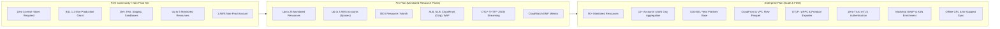

# AWS Log to OpenTelemetry Processor: Subscription Plans & Feature Matrix

This document outlines the subscription plan architecture, feature entitlement matrix, and operational terms for **AWS Log to OpenTelemetry Processor (`otel-aws-log-processor`)**.

---

## 1. Product Philosophy: Developer-First & Enterprise-Monetizable

`otel-aws-log-processor` is engineered with a dual mandate:

1. **Frictionless Non-Production & Local Development (Community Tier)**:
   Individual developers, DevOps engineers, and testing pipelines should never encounter licensing friction, token setup hurdles, or telemetry gates during local testing, development, staging, or pull request verification. Under our Business Source License 1.1 (BSL 1.1) Additional Use Grant, non-production environments (`dev`, `staging`, `test`, `preview`, `poc`, `sandbox`) are **inherently free** and **completely unencumbered**.
2. **Zero-Friction Guarantee for Non-Production**:
   When an execution is detected in a non-production environment, the processor automatically authorizes all log processing free of charge. No license key or remote call is needed.
3. **High-Value Enterprise Monetization (Pro & Enterprise Plans)**:
   Production commercial workloads require a signed license key. Standard single-account load balancer and WAF pipelines operate under predictable pricing (**Pro Plan**), while high-throughput column-oriented Parquet streaming, cross-account AWS Organization fleets, gRPC transports, mTLS, and GeoIP enrichment reside in the **Enterprise Plan**.

---

## 2. Subscription Plans Overview


```mermaid
flowchart LR
    subgraph Community["Free Community / Non-Prod Tier"]
        C1["Zero License Token Required"]
        C2["BSL 1.1 Non-Production Grant"]
        C3["Dev, Test, Staging, Sandboxes"]
        C4["Up to 5 Monitored Resources"]
        C5["1 AWS Non-Prod Account"]
    end

    subgraph Pro["Pro Plan (Monitored Resource Packs)"]
        P1["Up to 25 Monitored Resources"]
        P2["Up to 3 AWS Accounts (Spokes)"]
        P3["$50 / Resource / Month"]
        P4["ALB, NLB, CloudFront (Gzip), WAF"]
        P5["OTLP / HTTP JSON Streaming"]
        P6["CloudWatch EMF Metrics"]
    end

    subgraph Enterprise["Enterprise Plan (Scale & Fleet)"]
        E1["50+ Monitored Resources"]
        E2["10+ Accounts / AWS Org Aggregation"]
        E3["$18,000 / Year Platform Base"]
        E4["CloudFront & VPC Flow Parquet"]
        E5["OTLP / gRPC & Protobuf Exporter"]
        E6["Zero-Trust mTLS Authentication"]
        E7["MaxMind GeoIP & ASN Enrichment"]
        E8["Offline CRL & Air-Gapped Sync"]
    end

    Community --> Pro --> Enterprise
```

### Plan Summary

| Plan | Target Audience | Monitored Resource Capacity | Included Monthly Throughput | AWS Account Scope | Indicative Commercial Pricing | Key Architectural Focus |
|---|---|:---:|:---:|:---:|:---:|---|
| **Community Tier (Free BSL)** | Developers, DevOps, QA, CI/CD | Up to 5 Resources | 50 GB / month | 1 Account (Non-Prod) | **$0** (Free Forever) | Frictionless evaluation, staging validation, and local development |
| **Pro Plan (Resource Pack)** | Growth Startups, Engineering Teams | Up to 25 Resources | Up to **10 TB / month** | Up to 3 Accounts | **$50 / res / mo** ($1,250/mo pack) | Production ALB, NLB, CloudFront Gzip, and WAF log streaming to OTLP (~$0.04/GB) |
| **Enterprise Plan** | Scale-Ups, Enterprises, SecOps | 50+ Resources (Flexible Packs) | Up to **50 TB / month** base | 10+ Accounts / AWS Org | Starts at **$18,000 / yr** base | High-throughput Parquet, cross-account aggregation, gRPC, mTLS, GeoIP (~$0.02/GB) |
| **Hyper-Scale Petabyte** | Media, AdTech, Gaming Streaming | Custom Resource Fleets | 250 TB+ to Petabytes | Enterprise AWS Org Fleet | **Custom ELA** | Committed capacity, true-up billing, sub-cent ingestion (~$0.008–$0.015/GB) |

---

## 3. Comprehensive Feature Entitlement Matrix

The following table details feature availability and runtime verification mechanics across all tiers:

| Capability / Module | Feature Identifier | Community Tier (Free BSL) | Pro Plan (Prod) | Enterprise Plan (Prod) | Verification Behavior |
|---|---|:---:|:---:|:---:|---|
| **Non-Production Workloads** | `runtime.non_prod` | ✅ Included | ✅ Included | ✅ Included | Exempt under BSL 1.1 Grant |
| **ALB Access Logs (`.log`, `.gz`)** | `parser.alb` | ✅ Included | ✅ Included | ✅ Included | Validated via `claims.AssertFeature` |
| **NLB TCP/TLS Logs (`.log`, `.gz`)** | `parser.nlb` | ✅ Included | ✅ Included | ✅ Included | Validated via `claims.AssertFeature` |
| **CloudFront Standard Logs (`.gz`)** | `parser.cloudfront.gzip` | ✅ Included | ✅ Included | ✅ Included | Validated via `claims.AssertFeature` |
| **AWS WAF JSON Access Logs** | `parser.waf` | ✅ Included | ✅ Included | ✅ Included | Validated via `claims.AssertFeature` |
| **S3 / SQS / EventBridge Ingest** | `events.ingestion` | ✅ Included | ✅ Included | ✅ Included | Validated via `claims.AssertFeature` |
| **OTLP / HTTP Exporter** | `sender.otlp_http` | ✅ Included | ✅ Included | ✅ Included | Validated via `claims.AssertFeature` |
| **Secrets Manager Basic Auth** | `security.secrets_manager` | ✅ Included | ✅ Included | ✅ Included | Validated via `claims.AssertFeature` |
| **CloudWatch EMF Compliance Metrics** | `metrics.emf` | ✅ Included | ✅ Included | ✅ Included | Validated via `claims.AssertFeature` |
| **CloudFront Parquet Parser** | `parser.cloudfront.parquet` | ❌ | ❌ | ✅ Included | Validated via `claims.AssertFeature` |
| **VPC Flow Logs (Plain & Parquet)** | `parser.vpc_flow` | ❌ | ❌ | ✅ Included | Validated via `claims.AssertFeature` |
| **AWS CloudTrail JSON Digests** | `parser.cloudtrail` | ❌ | ❌ | ✅ Included | Validated via `claims.AssertFeature` |
| **Route 53 DNS Query Logs** | `parser.route53` | ❌ | ❌ | ✅ Included | Validated via `claims.AssertFeature` |
| **Cross-Account Log Ingestion** | `scope.cross_account` | ❌ | ❌ | ✅ Included | Validated via `claims.AssertFeature` & Account Scope |
| **AWS Organization-Wide Fleet** | `scope.organization` | ❌ | ❌ | ✅ Included | Validated via `claims.Scope` |
| **OTLP / gRPC Exporter** | `sender.otlp_grpc` | ❌ | ❌ | ✅ Included | Validated via `claims.AssertFeature` |
| **mTLS Client Certificate Auth** | `security.mtls` | ❌ | ❌ | ✅ Included | Validated via `claims.AssertFeature` |
| **MaxMind GeoIP / ASN Enrichment** | `enrichment.geoip` | ❌ | ❌ | ✅ Included | Validated via `claims.AssertFeature` |
| **User-Agent String Parser** | `enrichment.useragent` | ❌ | ❌ | ✅ Included | Validated via `claims.AssertFeature` |
| **Offline / Online CRL Revocation** | `license.crl` | ✅ Included | ✅ Included | ✅ Included | Verified via `ResolveOfflineCRL` & `DIVMORA_CRL_URL` |
| **All Future Modules** | `*` | ❌ | ❌ | ✅ Included | Wildcard entitlement |

---

## 4. Module & Capability Details

### 4.1 Community Tier Capabilities
- **Non-Production Environments (`runtime.non_prod`)**: Automatic license exemption when `DIVMORA_ENVIRONMENT`, `ENVIRONMENT`, `STAGE`, or `APP_ENV` is set to `dev`, `staging`, `test`, `preview`, `poc`, or `sandbox`.
- **Core Access Log Streaming**: Full support for raw and gzip-compressed Application Load Balancer (ALB), Network Load Balancer (NLB), CloudFront Standard, and AWS WAF JSON logs.
- **OTLP/HTTP Forwarding**: Standard HTTP batch exporter with exponential backoff and retry.
- **Fair-Use Limits**: Non-production instances enforce batch density and container cumulative volume fair-use ceilings to prevent unmonetized production usage.

### 4.2 Pro Plan Capabilities
- **Monitored Resource Pack Scope**: Authorized for commercial production execution for up to 25 monitored resources across up to 3 AWS Accounts (spokes).
- **Standard Ingestion Engines**: Production-grade parsing and OTLP transformation of ALB, NLB, CloudFront (Gzip), and AWS WAF logs.
- **Secrets Manager Integration**: Securely resolves collector credentials via AWS Secrets Manager.
- **CloudWatch EMF Compliance & Active Resource Metrics**: Zero-overhead asynchronous metric logging to CloudWatch Logs with dimensioned license status tracking and `ActiveMonitoredResources` gauges.

### 4.3 Enterprise Plan Capabilities
- **Scale Resource Packs & Multi-Account Fleet**: 50+ monitored resources across 10+ accounts or entire AWS Organizations without per-account pricing friction.
- **High-Throughput Parquet Processing (`parser.cloudfront.parquet`, `parser.vpc_flow`)**: Ingests column-oriented Parquet log files directly from S3 using streaming record readers, drastically reducing data transfer and memory overhead.
- **Cross-Account & AWS Organization Ingestion (`scope.cross_account`, `scope.organization`)**: Enables centralized log processor Lambdas to ingest SQS and S3 notifications across dozens or hundreds of AWS accounts within an AWS Organization.
- **Zero-Trust Exporter Security (`security.mtls`, `sender.otlp_grpc`)**: Binary Protobuf serialization via HTTP/2 gRPC streaming and mutual TLS client certificate verification for air-gapped or zero-trust OTLP collectors.
- **Offline Telemetry Enrichment (`enrichment.geoip`, `enrichment.useragent`)**: Enriches client IP addresses with MaxMind GeoLite2/GeoIP2 database country, city, and ASN data, and parses User-Agent headers into OTel client attributes.
- **Air-Gapped CRL Revocation (`license.crl`)**: Full support for sidecar `.divcrl` offline revocation files in air-gapped VPCs and remote HTTPS CRL distribution points (`DIVMORA_CRL_URL`).

---

## 5. Monitored Resource Packs: Architectural Decoupling & Schema

### 5.1 The Multi-Spoke Micro-Account Pricing Problem
Modern cloud-native AWS architectures rely on multi-account landing zone designs (AWS Control Tower, Landing Zone Accelerator, AWS Organizations). In these topologies, engineering teams deploy isolated micro-workloads into dedicated spoke accounts—for example, 25 spoke accounts each running a single Application Load Balancer.

Traditional commercial licensing that charges by raw AWS Account count creates an artificial **25x cost penalty** for these architectures, even though the infrastructure footprint and log throughput are identical to a single monolith account hosting 25 ALBs.

To align with modern cloud infrastructure best practices, `otel-aws-log-processor` decouples commercial charging from raw AWS account counts, introducing **Monitored Resource Packs**.

### 5.2 Definition of a Monitored Resource
A Monitored Resource represents a unique active ingress infrastructure endpoint whose access logs are ingested and processed into OpenTelemetry records:

| Resource Type | Resource Identifier Format | Extracted From |
|---|---|---|
| **Application Load Balancer (ALB)** | `arn:aws:elasticloadbalancing:<region>:<account>:loadbalancer/app/<name>/<id>` | Parsed OTel attribute (`alb.arn`) or S3 key (`.../elasticloadbalancing/.../app/...`) |
| **Network Load Balancer (NLB)** | `arn:aws:elasticloadbalancing:<region>:<account>:loadbalancer/net/<name>/<id>` | Parsed OTel attribute (`nlb.arn`) or S3 key (`.../elasticloadbalancing/.../net/...`) |
| **Amazon CloudFront Distribution** | Distribution ID (e.g., `EDFDVBD632BHFR5`) or CloudFront ARN | Parsed OTel attribute (`cloudfront.distribution_id`) or S3 key |
| **AWS WAF WebACL** | `arn:aws:wafv2:<region>:<account>:regional/webacl/<name>/<id>` or CloudFront global WebACL | Parsed OTel attribute (`waf.web_acl_id`) or S3 key (`.../aws-waf-logs-...`) |

### 5.3 License Claims Schema (`claims.Scope`)

Commercial Ed25519 tokens incorporate resource quota definitions directly into the signed payload `claims.Scope`:

```json
{
  "id": "lic_9901abcdef",
  "plan": "pro",
  "product": "otel-aws-log-processor",
  "customer": "Example Corp",
  "features": ["parser.alb", "parser.nlb", "parser.cloudfront.gzip", "parser.waf", "metrics.emf"],
  "limits": {
    "max_resources": 25,
    "max_accounts": 3,
    "max_monthly_gb": 10000,
    "max_container_records": 50000
  },
  "scope": {
    "accounts": ["123456789012", "234567890123", "345678901234"],
    "resources": [
      "arn:aws:elasticloadbalancing:us-east-1:123456789012:loadbalancer/app/*",
      "arn:aws:elasticloadbalancing:us-east-1:234567890123:loadbalancer/app/api-*",
      "EDFDVBD632BHFR5"
    ]
  },
  "exp": 1893456000
}
```

#### Field Specifications:
- `claims.Limits.MaxResources` (`int`): Maximum count of unique active monitored resources permitted within the running Lambda container lifecycle.
  - **Backwards Compatibility**: When `max_resources == 0` or is omitted (such as in legacy commercial licenses), the resource count is **uncapped**, ensuring zero disruption to existing production contracts.
- `claims.Scope.Resources` (`[]string`): Optional list of authorized resource identifiers, supporting:
  - Exact ARN or short ID matches (`arn:aws:elasticloadbalancing:us-east-1:123456789012:loadbalancer/app/api/50dc6c495c0c9188` or `EDFDVBD632BHFR5`).
  - Hierarchical wildcard glob patterns (`*` and `?`), crossing `/` and `:` delimiters (e.g. `arn:aws:elasticloadbalancing:*:*:loadbalancer/app/prod-*`).
  - Suffix matching against short load balancer IDs (e.g. matching `app/prod-api/123` against full ARN).
- `claims.Limits.MaxAccounts` (`int`): Maximum count of AWS accounts authorized under the license pack.

### 5.4 In-Container Runtime Tracking & Enforcement

The processor runtime utilizes a thread-safe `ResourceTracker` (`sync.RWMutex`) to identify and deduplicate active resources across concurrent SQS worker goroutines:

1. **Pre-flight Fast Fail**: Standard account and feature validations occur before S3 downloads.
2. **Dynamic Ingestion Extraction**: As log records are parsed, resource identifiers are extracted from both S3 keys and parsed record attributes.
3. **Tracking & Deduplication**: Active resources are added to the container's `ResourceTracker`.
4. **Enforcement Modes**:
   - **`DIVMORA_LICENSE_MODE=warn` (Default)**: If active monitored resources exceed `MaxResources`, or a resource is not listed in `Resources`, the invocation logs a structured warning and stamps `divmora.license.status=resource_quota_exceeded` or `resource_not_allowed` on exported telemetry without interrupting the data stream.
   - **`DIVMORA_LICENSE_MODE=strict`**: Quota breaches return deterministic errors (`ErrResourceQuotaExceeded` or `ErrResourceNotAllowed`). Combined with `DIVMORA_LICENSE_FAILURE_ACTION=discard`, the Lambda acknowledges the message to cleanly halt cost-inflating SQS redrive loops while recording violation telemetry.
5. **CloudWatch EMF Metric Schema**:
   The runtime publishes dimensioned metrics under the `Divmora/LogProcessor` and `Divmora/License` namespaces with sub-millisecond async emission:
   ```json
   {
     "_aws": {
       "Timestamp": 1790589879443,
       "CloudWatchMetrics": [
         {
           "Namespace": "Divmora/LogProcessor",
           "Dimensions": [["Environment", "Status"], ["Environment"]],
           "Metrics": [
             {"Name": "RecordsProcessed", "Unit": "Count"},
             {"Name": "BytesProcessed", "Unit": "Bytes"},
             {"Name": "LicenseViolations", "Unit": "Count"},
             {"Name": "ActiveMonitoredResources", "Unit": "Count"}
           ]
         },
         {
           "Namespace": "Divmora/License",
           "Dimensions": [["LicenseID", "Tier"], ["LicenseID", "Tier", "ResourceARN"]],
           "Metrics": [
             {"Name": "BytesProcessed", "Unit": "Bytes"},
             {"Name": "RecordsProcessed", "Unit": "Count"}
           ]
         }
       ]
     },
     "Environment": "production",
     "Status": "valid",
     "RecordsProcessed": 1500,
     "BytesProcessed": 10485760,
     "LicenseViolations": 0,
     "ActiveMonitoredResources": 18,
     "LicenseID": "lic_9901abcdef",
     "Tier": "pro",
     "ResourceARN": "arn:aws:elasticloadbalancing:us-east-1:123456789012:loadbalancer/app/api/50dc6c495c0c9188"
   }
   ```

---

## 6. Commercial Packaging & Fair-Use Bandwidth Ceilings

### 6.1 The Hyper-Scale Petabyte Under-Monetization Loophole
AWS CloudWatch Logs charges **$0.50 per Gigabyte ($500 per Terabyte)** for ingestion:
1. **The Extreme Scale Disconnect**: For an enterprise media, ad-tech, or gaming customer processing **500 TB/month** across just 2 or 3 CloudFront distributions, native CloudWatch ingestion would cost **$250,000/month ($3,000,000/year)**. If `otel-aws-log-processor` only charged flat fees per resource (e.g. 2 CloudFront distributions = $1,200–$4,800/yr), Divmora would capture less than 0.1% of the value created while assuming enterprise support liability for petabyte pipelines.
2. **Preserving Budget Predictability**: Customers avoid CloudWatch and Datadog because variable metering causes sudden bill shock. Divmora does **not** enforce unpredictable per-GB micro-metering. Instead, we provide **Generous Fixed Tier Caps with Soft Fair-Use True-Up Volume Packs** (similar to Datadog Commitments or Grafana Cloud volume packs).
3. **Pipeline Safety Invariant**: Under no circumstances should high-volume production logs ever be dropped or blocked due to throughput limits. Enforcement is **strictly soft and non-blocking**, emitting structured telemetry for contractual true-ups.

### 6.2 Commercial Packaging & Fair-Use Bands

| Tier | Included Monthly Throughput | Overage / Expansion Pricing | Effective Ingestion Rate |
|---|:---:|---|:---:|
| **Community (BSL 1.1)** | 50 GB / month | Non-production fair-use cap | $0 (Free) |
| **Team / Pro** | Up to **10 TB / month** included | Upgrade to Enterprise | ~$0.04 / GB (vs CloudWatch $0.50/GB) |
| **Enterprise Base** | Up to **50 TB / month** included | **+$500/mo per 25 TB** volume pack | ~$0.02 / GB (>96% savings over CloudWatch) |
| **Hyper-Scale Petabyte** | 250 TB+ to Petabytes | Custom ELA (Committed capacity) | ~$0.008–$0.015 / GB |

### 6.3 Claims Schema: `claims.Limits.MaxMonthlyGB`
Throughput allocations and resource quotas are cryptographically encoded in the signed license token claims under `limits`:

```json
{
  "id": "lic_9901abcdef",
  "plan": "pro",
  "limits": {
    "max_resources": 25,
    "max_accounts": 3,
    "max_monthly_gb": 10000,
    "max_container_records": 50000
  },
  "scope": {
    "accounts": ["123456789012"],
    "resources": [
      "arn:aws:elasticloadbalancing:us-east-1:123456789012:loadbalancer/app/*"
    ]
  }
}
```

- **`claims.Limits.MaxMonthlyGB` (`max_monthly_gb`)**: Specifies the fair-use monthly throughput ceiling in Gigabytes (e.g. `50` for Community, `10000` for Pro 10 TB, `50000` for Enterprise 50 TB). A value of `0` or omitted indicates an uncapped or unlimited allocation (preserving 100% backward compatibility for existing commercial licenses).
- **`claims.Limits.MaxResources` (`max_resources`)**: Maximum cumulative unique monitored resources authorized for log ingestion.
- **`claims.Limits.MaxAccounts` (`max_accounts`)**: Maximum allowed spoke AWS accounts.
- **`claims.Scope.Resources` (`resources`)**: Explicit allowed resource ARNs, prefixes, wildcards, or IDs.

### 6.4 Non-Blocking Soft Enforcement & Rate-Limited Warning Banner
When cumulative volume breaches the fair-use quota:
- **Never Drop or Block Batches**: Log processing continues at 100% full line rate. Zero log records are dropped, delayed, or dead-lettered.
- **Structured Warning Banner**: The runtime emits a rate-limited CloudWatch log warning (at most once every 60 minutes per Lambda container):
  ```
  [WARN_FAIR_USE_THROUGHPUT_EXCEEDED] Monthly log volume has exceeded the licensed fair-use allocation (Allocated: 10000 GB). Telemetry processing continues uninterrupted without data loss. Please contact licensing@divmora.com to adjust your commitment tier.
  ```
- **CloudWatch EMF Metric**: The runtime emits custom metric `BytesProcessed` under namespaces `Divmora/LogProcessor` (Unit: Bytes) and `Divmora/License` with dimensions `[LicenseID, Tier, Region]` and `[LicenseID, Tier, ResourceARN]` to enable automated billing audit synchronization and true-up invoicing.

### 6.5 Centralized Metrics Region & Multi-Region Aggregation
In enterprise multi-region deployments, Lambda processors can be deployed across any AWS region (e.g. `eu-west-1`, `us-west-2`, `ap-southeast-1`), while operational and licensing metrics must aggregate into a single centralized region:
- **Authoritative Resolution**: The target metrics region is determined strictly from the cryptographically signed license metadata (`claims.Metadata["metrics_region"]` or `"cloudwatch_metrics_region"`), defaulting strictly to **`us-east-1`**. Environment variable overrides are deliberately excluded to ensure deterministic aggregation and prevent quota splitting across stacks.
- **Zero-Latency In-Region Ingestion**: When running in the central region (`currentRegion == centralRegion`), metrics are emitted via EMF to `stdout` with 0ms network latency and zero API cost.
- **Automated Cross-Region Dispatch**: When running in a remote region (`currentRegion != centralRegion`), the runtime emits local EMF to `stdout` and automatically dispatches `PutMetricData` directly across regions to the central metrics region via the AWS CloudWatch SDK.
- **Unified Global Aggregation with Regional Attribution**: The `Region` dimension records the source execution region, allowing single-query global aggregation (`SUM(BytesProcessed)`) in the central region while preserving full regional observability.

---

## 7. Commercial License Activation & Configuration

Commercial licenses are cryptographically signed Ed25519 tokens (format `DIV1.<payload>.<sig>`). Configure tokens via any of the following methods:

### 1. AWS CloudFormation Parameter
```bash
aws cloudformation deploy \
  --template-file otel-aws-log-processor-lambda.yaml \
  --stack-name otel-aws-log-processor-prod \
  --capabilities CAPABILITY_NAMED_IAM \
  --parameter-overrides \
    EnvironmentName=prod \
    DivmoraLicenseKey="DIV1.eyJpZCI..."
```

### 2. AWS Secrets Manager (Recommended for Production)
Store the token in AWS Secrets Manager and pass the Secret ARN:
```bash
aws cloudformation deploy \
  --template-file otel-aws-log-processor-lambda.yaml \
  --stack-name otel-aws-log-processor-prod \
  --capabilities CAPABILITY_NAMED_IAM \
  --parameter-overrides \
    EnvironmentName=prod \
    DivmoraLicenseKeySecretArn="arn:aws:secretsmanager:us-east-1:123456789012:secret:divmora/license-key"
```

### 3. Environment Variable (Docker & Local Testing)
```bash
export DIVMORA_LICENSE_KEY="DIV1.eyJpZCI..."
export DIVMORA_LICENSE_MODE="strict" # or "warn"
```

---

## 8. Verifying License & Plan Status

### Using `license-cli`

Inspect claims, entitlement scopes, plan tiers, and features:

```bash
# Install the universal Divmora license CLI
go install github.com/divmora/license-go/cmd/license-cli@v1.3.1

# Inspect signed claims, plan tier, and feature entitlements
license-cli inspect -license /path/to/license.key

# Verify against specific product requirements
license-cli verify -license /path/to/license.key -product otel-aws-log-processor
```

---

## 9. Commercial Inquiries & Subscriptions

To acquire a commercial **Pro** or **Enterprise** subscription, add custom feature flags, or request offline air-gapped node licenses:

- **Website**: [https://divmora.com](https://divmora.com)
- **Licensing Email**: [licensing@divmora.com](mailto:licensing@divmora.com)
- **Support**: [support@divmora.com](mailto:support@divmora.com)
